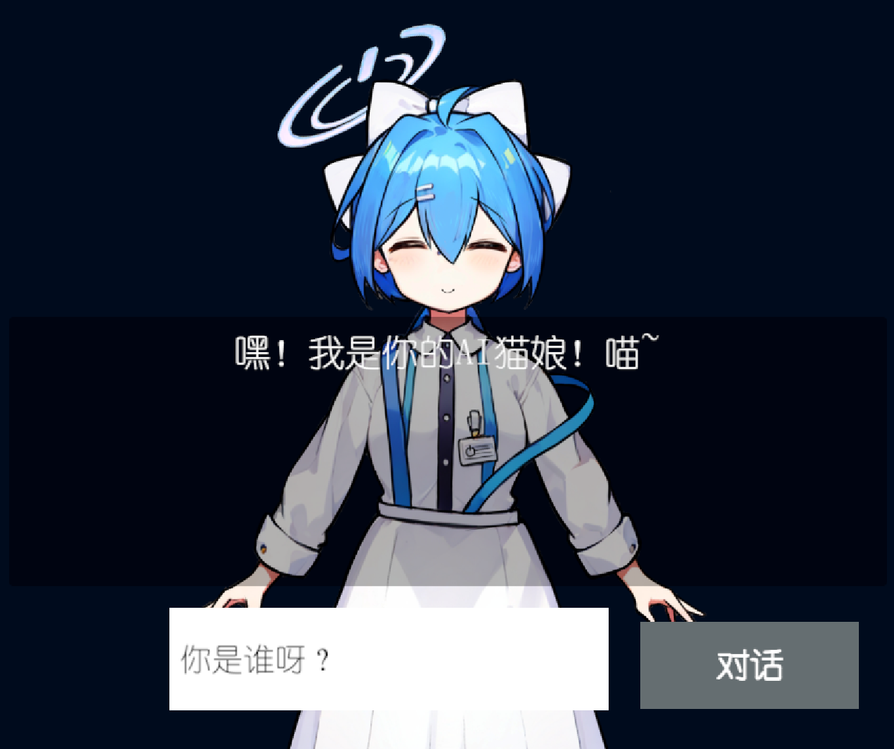
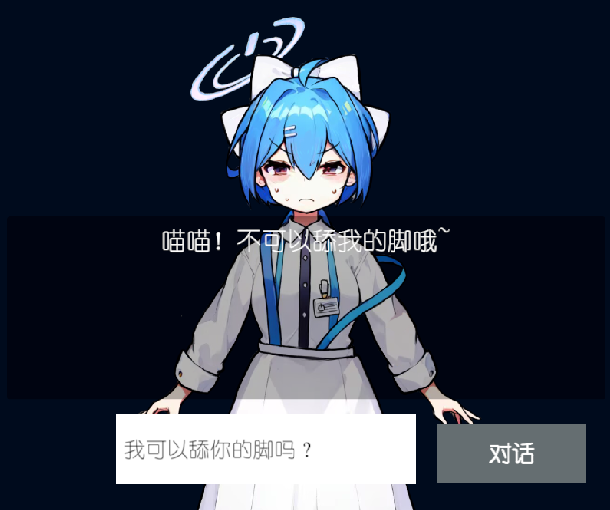

# UnityChattyChan

​​

An example of driving character dialogue and expressions through the function call feature of the OpenAI ChatGPT API, invoked via Unity

尝试在 Unity 中使用 OpenAI API 的 function call 功能，提供一个驱动 ChatBot 对话和展示表情的简单实例。是款 GameJam 去世作品中的模块。

原始请求实现参考 [zhangliwei7758/unity-AI-Chat-Toolkit: 使用unity实现AI聊天相关功能 (github.com)](https://github.com/zhangliwei7758/unity-AI-Chat-Toolkit)

主要在其 ChatGPT 模块基础上追加开发 function call 相关功能

## 实现速览

定义了部分结构体用于创建和回调 GPTFunction

一个创建显示对话和表情的 GPTFunction 样例如下（详情见完整工程）

```bash
private void InitSpeechAndExpressionFunc()
{
    // 定义参数
    var expressionParameters = new GPTFunctionParameters
    {
        type = "object",
        properties = new Dictionary<string, GPTFunctionParameterProperties>
        {
            {
                // 定义对话内容
                "speech", new GPTFunctionParameterProperties
                {
                    type = "string",
                    description = "Output the dialogue content to this parameter"
                }
            },
            {
                // 定义参数表情
                "expression", new GPTFunctionParameterProperties
                {
                    type = "string",
                    description = "Choose the expression to use, default to Idle",
                    Enum = Expressions
                }
            },
        },
        required = new List<string> { "speech" }
    };

    // 定义Function
    var expressionFunction = new GPTFunction(
        _name: "talk_with_expression",
        _description: "When not invoking other Func, please use this Func to create dialogues with expressions",
        _parameters: expressionParameters,
        _callback: SpeechAndExpressionCallback
    );
  
    Functions[FuncTypes.Normal].Add(expressionFunction);
}
```

## 表情差分效果展示

​

（虽然ChattyChan并不是猫娘）

​

（但是有光环，能代伊织，嘿嘿）